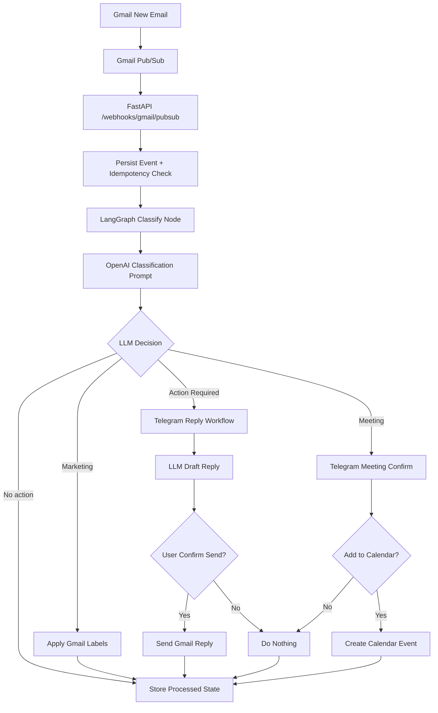

# Gmail Sorter

Event-driven Gmail assistant for triage, actioning, and approvals via Telegram.

## Project Highlights

- LangGraph-driven orchestration for multi-step agent workflows (classify, route, execute, review).
- OpenAI-powered decision engine for email classification, summary generation, and reply drafting.
- Production deployment on Oracle VPS with HTTPS reverse proxy, webhook architecture, and shared PostgreSQL.
- End-to-end event-driven design (Gmail Pub/Sub + Telegram webhooks) with idempotent processing.

Core stack:

- FastAPI + LangGraph
- OpenAI Chat Completions
- Gmail API + Google Calendar API
- Telegram Bot API (webhook mode)
- PostgreSQL
- Docker / Compose
- Oracle VPS (production host)

## Architecture



## Why This Is Advanced

- Agentic orchestration: uses LangGraph state transitions instead of one-shot scripts.
- Human-in-the-loop controls: action confirmation paths for replies and calendar actions.
- Production-ready infra: reverse proxy TLS, persistent database, auto-renewing Gmail watch, and webhook security controls.
- Observable behavior: workflow logs + deterministic state persistence for reproducibility.

## Current Behavior

- LLM-authoritative classification and action decisions.
- Assistant-style Telegram updates (clean, minimal messages).
- Reply workflow uses confirmation before sending; no draft-status noise.
- Action-required options include:
	- Draft Reply
	- I will type reply
	- Don't reply
- Inline buttons are removed after selection for cleaner chat UX.
- Meeting creation uses timezone-aware event insertion (`GOOGLE_CALENDAR_TIMEZONE`).

## Prompt Files

- `src/llm_prompts.md`: model instructions for classification and reply drafting.
- `src/prompts.md`: Telegram-facing message templates.

## Required Environment

LLM:

- `OPENAI_API_KEY`
- `OPENAI_MODEL`

Telegram:

- `TELEGRAM_BOT_TOKEN`
- `TELEGRAM_CHAT_ID`
- `TELEGRAM_WEBHOOK_SECRET` (recommended)

Google:

- `GOOGLE_TOKEN_PATH` (commonly `/app/token.json` in container)
- `GOOGLE_OAUTH_SCOPES` must include:
	- `https://www.googleapis.com/auth/gmail.modify`
	- `https://www.googleapis.com/auth/gmail.send`
	- `https://www.googleapis.com/auth/calendar.events`
- `GOOGLE_CALENDAR_ID` (default: `primary`)
- `GOOGLE_CALENDAR_TIMEZONE` (recommended: `Pacific/Auckland`)

Watch / PubSub:

- `GCP_PROJECT_ID`
- `GMAIL_PUBSUB_TOPIC`
- `GMAIL_WATCH_LABEL_IDS` (recommended: `INBOX`)

Database:

- `DATABASE_HOST`
- `DATABASE_PORT`
- `DATABASE_NAME`
- `DATABASE_USER`
- `DATABASE_PASSWORD`

## Register Gmail Watch

After OAuth token setup:

```powershell
python -m src.register_watch register
```

Stop watch:

```powershell
python -m src.register_watch stop
```

Auto-renew settings:

- `GMAIL_WATCH_AUTO_RENEW=true`
- `GMAIL_WATCH_RENEW_INTERVAL_SECONDS=21600`

## Telegram Webhook

Set webhook URL:

```text
https://wanagents.duckdns.org/webhooks/telegram
```

Set webhook with secret:

```text
https://api.telegram.org/bot<TELEGRAM_BOT_TOKEN>/setWebhook?url=https://wanagents.duckdns.org/webhooks/telegram&secret_token=<TELEGRAM_WEBHOOK_SECRET>
```

## Deployment (Oracle VPS)

This project is intended to run on an Oracle VPS using Docker Compose and a shared infrastructure layer.

- App service (`ai-platform_gmail-sorter`) joins the shared `ai_platform` Docker network.
- HTTPS termination and certificate automation are handled by the infrastructure stack in `ai-platform_infra`.
- Push-to-deploy can be managed through GitHub Actions for reproducible updates.

## Local LLM Smoke Test

Use the local test helper:

```powershell
python local/test-data/LLM/test_openai.py --mode smoke
python local/test-data/LLM/test_openai.py --mode classify --subject "package posted" --snippet "Your package has been posted and tracking number will follow shortly."
```