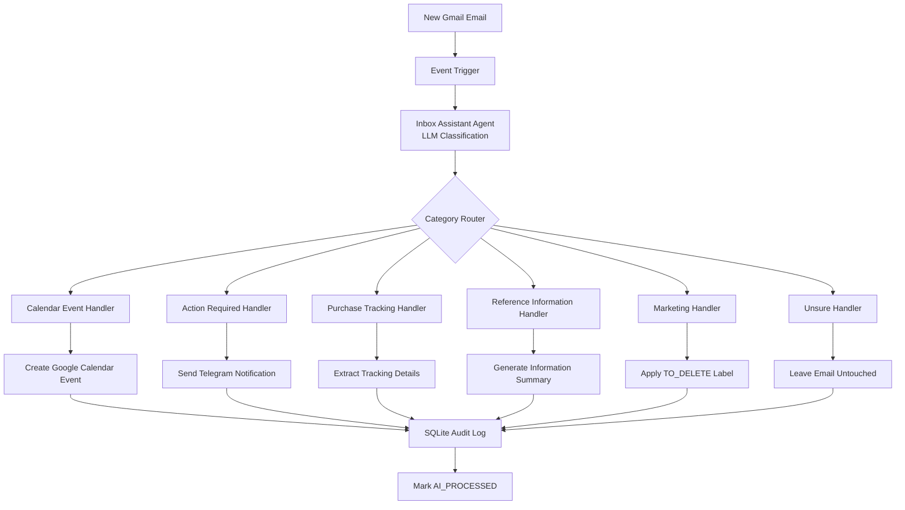
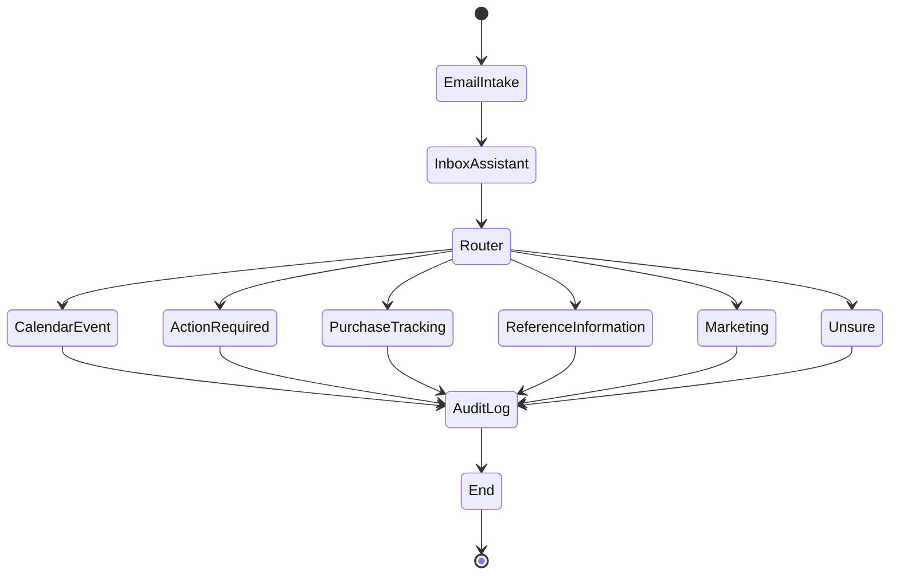
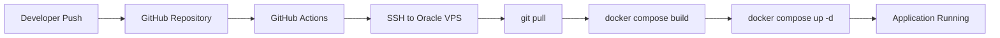

# Gmail AI Sorter - Technical Design Addendum

## Mermaid Architecture Diagram



---

## LangGraph Workflow Diagram



---

## LangGraph State Model

```python
class EmailState:
    gmail_message_id: str
    sender: str
    subject: str
    body: str

    category: str
    confidence: float
    summary: str

    entities: dict

    actions_performed: list
    processing_status: str
```

---

## Database DDL

### processed_emails

```sql
CREATE TABLE processed_emails (
    id INTEGER PRIMARY KEY AUTOINCREMENT,
    gmail_message_id TEXT UNIQUE NOT NULL,
    sender TEXT,
    subject TEXT,
    received_at DATETIME,
    processed_at DATETIME,
    category TEXT,
    confidence REAL,
    summary TEXT,
    status TEXT
);
```

### workflow_log

```sql
CREATE TABLE workflow_log (
    id INTEGER PRIMARY KEY AUTOINCREMENT,
    gmail_message_id TEXT,
    action TEXT,
    timestamp DATETIME,
    details TEXT
);
```

### sender_profiles

```sql
CREATE TABLE sender_profiles (
    sender_email TEXT PRIMARY KEY,
    sender_type TEXT,
    first_seen DATETIME,
    last_seen DATETIME,
    email_count INTEGER DEFAULT 0
);
```

---

## CI/CD Design

### Deployment Workflow



---

## GitHub Actions Workflow Specification

File:

```text
.github/workflows/deploy.yml
```

Trigger:

```yaml
on:
  push:
    branches:
      - main
```

Steps:

1. Checkout repository
2. Load GitHub Secrets
3. Connect to VPS via SSH
4. Navigate to application directory
5. Pull latest code
6. Rebuild Docker image
7. Restart containers
8. Verify deployment success

---

## Required GitHub Secrets

```text
VPS_HOST
VPS_USER
VPS_SSH_KEY
```

---

## Initial Validation Task

Before building the application:

1. Create repository.
2. Create .gitignore.
3. Push repository.
4. Configure GitHub Actions.
5. Configure VPS SSH deployment.
6. Test automatic deployment using a README change.
7. Confirm Docker container rebuilds automatically.

Only after CI/CD is functioning should application development begin.

---

## Build Order

Phase 1:

- Repository Structure
- .gitignore
- Dockerfile
- docker-compose.yml
- GitHub Actions
- VPS Deployment Test

Phase 2:

- SQLite Setup
- Gmail Integration
- Telegram Integration
- Google Calendar Integration

Phase 3:

- LangGraph Workflow
- Inbox Assistant Agent
- Router
- Action Handlers

Phase 4:

- Sender Reputation
- Analytics
- Dashboard
- Future Enhancements
